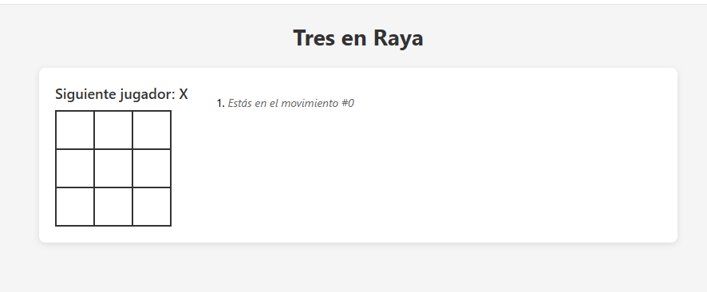
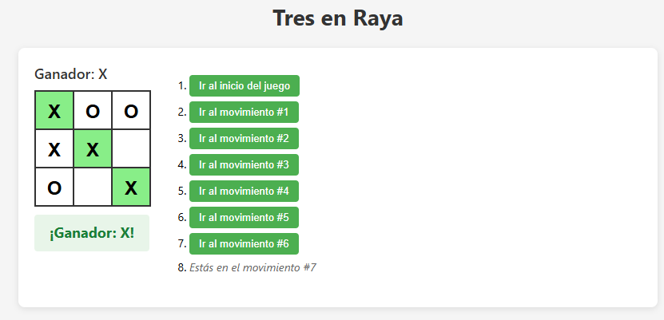
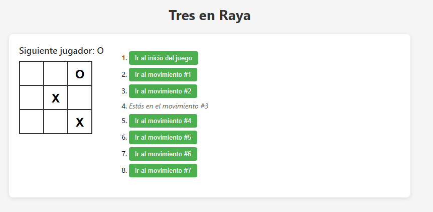
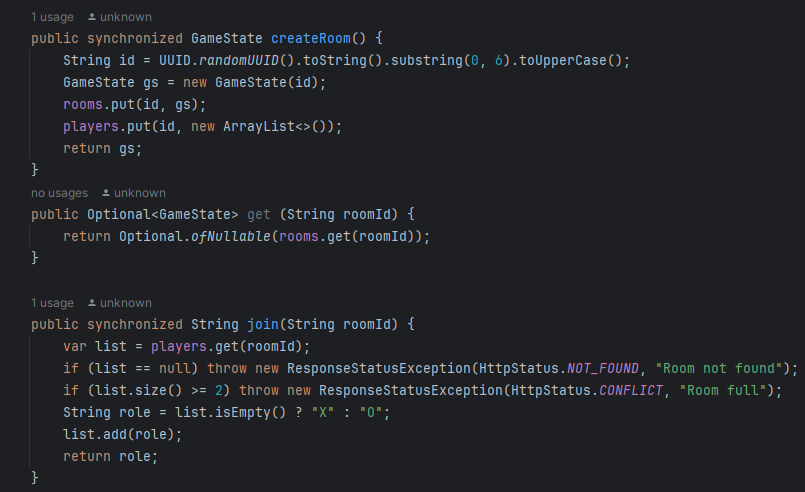
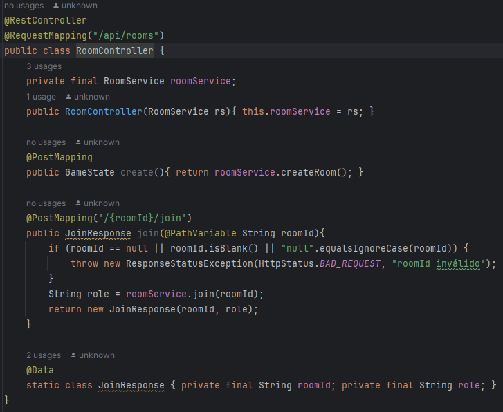
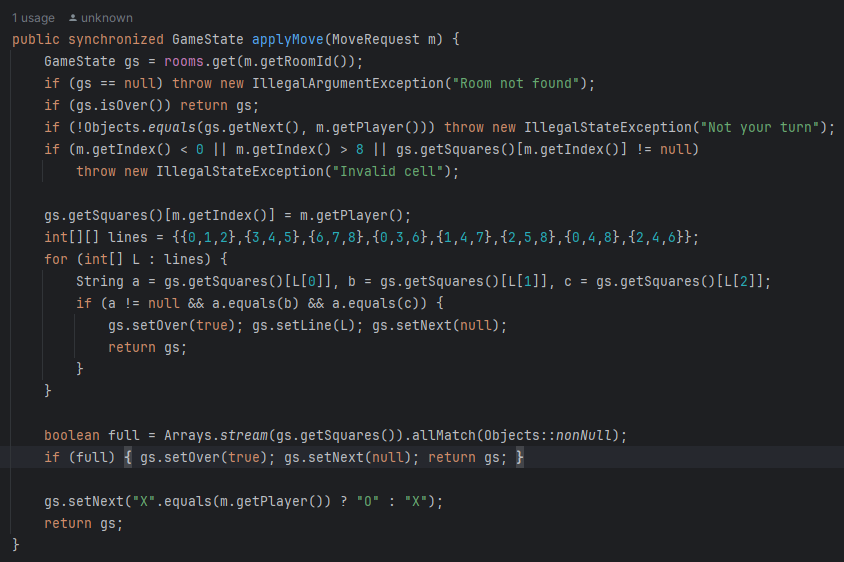
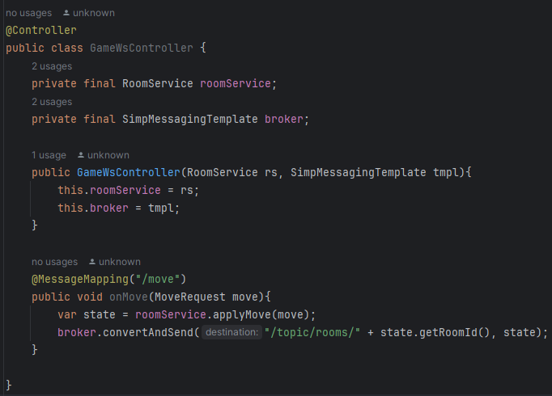
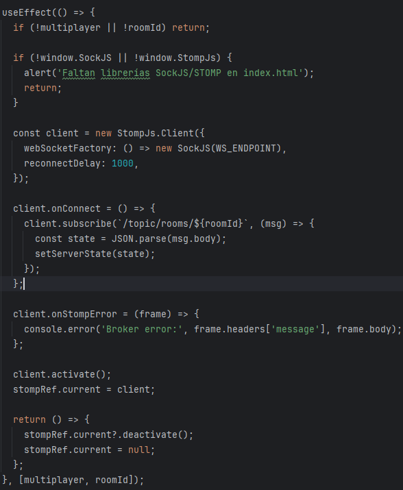
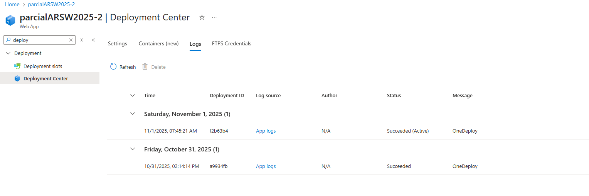
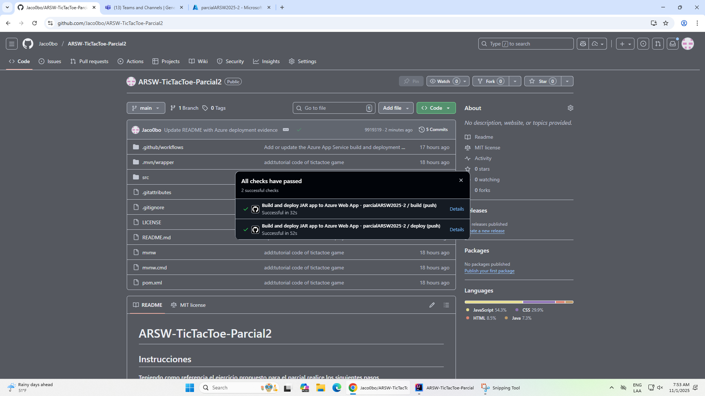

# ARSW-TicTacToe-Parcial2

## Instrucciones

**Teniendo como referencia el ejercicio propuesto para el parcial realice los siguientes pasos**

#### 1. Aprenda a construir un Juego Tic Tac Toe siguiendo el tutorial que se indica aquí: 

https://reactjs.org/tutorial/tutorial.html#before-we-start-the-tutorial (Repositorio ya construido)

**Juego previamente construido:**

El juego inicial consiste en un tablero 3x3 en el que cada turno se van poniendo "X" o "O" dependiendo del jugador:

El objetivo es conseguir 3 "X" o "O" en linea o diagonal:

Ademas cuenta con la funcionalidad de poder devolver los movimientos de manera que si un jugador se equivoco puede volver 
y reintentarlo:

#### 2. A partir de este Juego construya una aplicación interactiva usando WebSockets que permita:

 **a. Crear una sala**

 **b. Entrar a una sala**

Para ello creamos la clase roomService la cual contiene los metodos para poder crear y unirse a salas, estos metodos son
syncronized para evitar condiciones de carrera por que dos jugadores intentaron hacer un movimiento al mismo tiempo:

Y tambien la clase RoomController que al final es la que usa el front ``app.js`` y ``index.html`` para poder acceder a estos servicios:

 **c. Jugar a dos jugadores en forma interactiva una partida de Tic Tac Toe**

Para ello usamos el metodo ``applyMove`` de ``RoomService`` y la clase controller ``GameWsController`` la cual se encarga de manejar la logica de los movimientos de la sala obteniendo el estado
de la misma y enviandoselos a ``app.js`` para que muestre los movimientos por pantalla:

 **d. El sistema debe persistir las salas y el estado de Juego a una base de datos.**

 **e. El sistema debe permitir retroceder en la historia en cada sala. Una sala recuperada de la base de datos debe traer sus historia y permitir por ejemplo retroceder en el juego normalmente.**

#### BONO: Desplegado en la nube. 

**Evidencia despliegue haciendo uso de Azure:**

